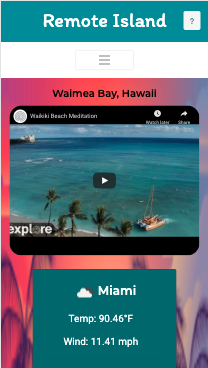
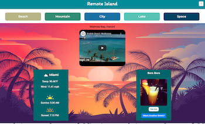
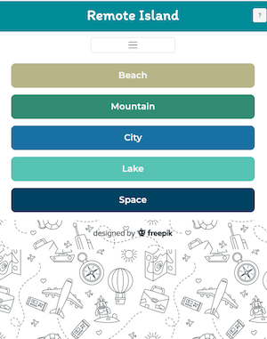

# gt-project-1
## Description 

This is our first project for the GT Full Stack Flex Program. This project was created to provide a solution to everyone's want to escape! We created a website where the user can decide what type of vacation they are interested in and it will then take you to the next page where you will see a video taking you to a destination. Below that you have the options to view weather that is similar to that destination and a cocktail that you can get the ingredients included and recipe from or have the option to view a different drink. 

## Table of Contents

* [Installation](#installation)
* [Usage](#usage)
* [Credits](#credits)
* [MIT License](#mit_license)
* [Badges](#badges)
* [Contributing](#contributing)
* [Tests](#tests)

## Installation

1. Clone the repo
2. Open the index.html file

[Link to Code](https://jaredp17.github.io/gt-project-1/)
 
[Crystal's Portfolio Page](https://github.com/CrystalWatkins)

[Danielle's Portfolio Page](https://github.com/DanielleByrne)

[Jared's Portfolio Page](https://github.com/JaredP17/gt-project-1)

[Jennifer's Portfolio Page](https://github.com/jenniferdaeumler)

## Usage 

This project combined a lot of the things that we have learned in class. 
It included third party APIs, styling CSS and Bootstrap and designing a 
UI experience that is mobile first. 

[Link to Code](#).
 
 
 
 

## Credits

This was our first project for the Georgia Tech, FullStack Flex Program.
OpenWeather API [https://openweathermap.org/]
YouTube API [https://developers.google.com/youtube/v3]
CocktailDB API [https://www.thecocktaildb.com/api.php]

## MIT_License

Copyright (c) [2020] [Crystal Watkins, Danielle Byrne, Jared Porter, and Jennifer Daeumler]

Permission is hereby granted, free of charge, to any person obtaining a copy
of this software and associated documentation files (the "Software"), to deal
in the Software without restriction, including without limitation the rights
to use, copy, modify, merge, publish, distribute, sublicense, and/or sell
copies of the Software, and to permit persons to whom the Software is
furnished to do so, subject to the following conditions:

The above copyright notice and this permission notice shall be included in all
copies or substantial portions of the Software.

THE SOFTWARE IS PROVIDED "AS IS", WITHOUT WARRANTY OF ANY KIND, EXPRESS OR
IMPLIED, INCLUDING BUT NOT LIMITED TO THE WARRANTIES OF MERCHANTABILITY,
FITNESS FOR A PARTICULAR PURPOSE AND NONINFRINGEMENT. IN NO EVENT SHALL THE
AUTHORS OR COPYRIGHT HOLDERS BE LIABLE FOR ANY CLAIM, DAMAGES OR OTHER
LIABILITY, WHETHER IN AN ACTION OF CONTRACT, TORT OR OTHERWISE, ARISING FROM,
OUT OF OR IN CONNECTION WITH THE SOFTWARE OR THE USE OR OTHER DEALINGS IN THE
SOFTWARE.

## Badges

## Contributing

Contributors: Crystal Watkins, Danielle Byrne, Jared Porter, and Jennifer Daeumler.
Not currently taking any additional contributions at this time.

## Tests

There is no test needed for this project. 

